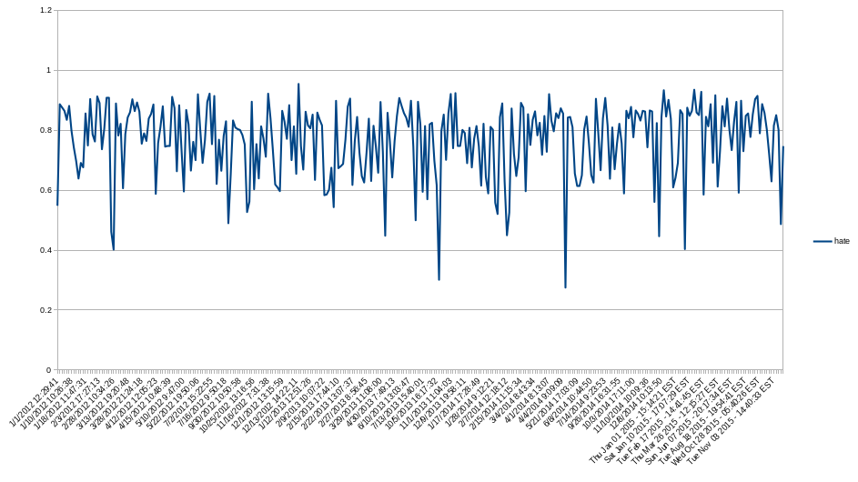

# linusrants
Just a collection of all the rants from Linus Torvalds on the kernel mailing list from 2012 to 2015 classified by the amount of hate and sorted by it.

## Data

|  Rant	  |         Hate           |
|----------|------------------------|
| Kay, this needs to be fixed. ... Of course, I'd also suggest that whoever was the genius who thought it was a good idea to read things ONE F\*CKING BYTE AT A TIME with system calls for each byte should be retroactively aborted. Who the f\*ck does idiotic things like that? How did they noty die as babies, considering that they were likely too stupid to find a tit to suck on? | 0.621010024824 |
| So get your act together, and push back on the people you are supposed to manage. Because this is *not* acceptable for post-rc5, and I'm giving this single warning. Next time, I'll just ignore the sh\*t you send me. Comprende? | 0.701378112737 |
| What the F\*CK, guys? This piece-of-shit commit is marked for stable, but you clearly never even test-compiled it, did you? ...The declaration for gate_desc is very very different for 32-bit and 64-bit x86 for whatever braindamaged reasons. Seriously, WTF? I made the mistake of doing multiple merges back-to-back with the intention of not doing a full allmodconfig build in between them, and now I have to undo them all because this pull request was full of unbelievable shit. And why the hell was this marked for stable even *IF* it hadn't been complete and utter tripe? It even has a comment in the commit message about how this probably doesn't matter. So it's doubly crap: it's *wrong*, and it didn't actually fix anything to begin with. There aren't enough swear-words in the English language, so now I'll have to call you perkeleen vittupää just to express my disgust and frustration with this crap. | 0.813954024912 |
| Stop this idiotic "blame gcc bug" crap. Which part of my explanation for why it was *NOT* a compiler bug did you not understand? ... Stop the f\*cking around already! The  whole "we expect ww_ctx to be null" thing shows that YOU DO NOT SEEM TO UNDERSTAND WHAT THE TEST ACTUALLY IS! ... Christ, can you really not understand that? NO NO NO NO. No a f\*cking thousand times. It's not "too broken in gcc". It's too broken in the source code, and the fact that you don't even understand that is sad. You wrote the code, and you seem to be unable to admit that *your* code was buggy. It's not a compiler bug. It's your bug. Stand up like a man, instead of trying to flail around and blame anything else but yourself. So guys, get your act together, and stop blaming the compiler already. | 0.92104254021 |

If you're interested in the complete list of rants, it is available [in table form](table.md), [json format](data.json) and [pickle format](data.pkl).

If you'd like to do some analysis or plotting of the data, the best resource for that is [the full dataset in tsv format](rants.tsv), which includes a ton of metadata about each rant. Here's an extract of the data that you will find there:

| hate | markmail permalink | type(code, personal, both, unsure) | date | timestamp | mail excerpt |
|------|--------------------|------------------------------------|------|-----------|--------------|
| 0.6210100248237 | http://markmail.org/message/qwv74fvg3pqnk4eo | B | 06/07/12 13:29 | 1341574178 | Kay, this needs to be fixed... |
| 0.701378112736595 | http://markmail.org/message/zh5hmrt35h7aw7qp | C | 15/10/13 10:47 | 1381826864 | So get your act together... |
| 0.813954024912302 | http://markmail.org/message/6h3gtqeizljyjqio | C | 13/07/13 15:40 | 1373722801 | What the F\*CK, guys?... |
| 0.921042540209971 | http://markmail.org/message/gxmmhefjyijrucsd | B | 27/10/13 12:22 | 1382872960 | Stop this idiotic... |


## Analysis
Plot of hate levels vs time (x axis is not properly scaled):


## Build
To build it yourself just run:
```bash
python classify.py
```
Essentially, all I did was take a dataset of Linus rants already available[1] and send it through a sentiment analysis API[2], aggregating and sorting the results.

---

[1] Original raw dataset of Linus Torvalds rants can be found at https://data.world/jboutros/linus-rants

[2] http://text-processing.com/docs/sentiment.html
